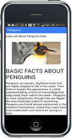
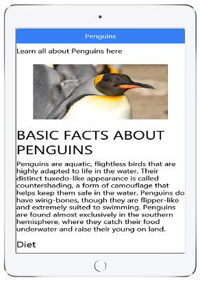

<h1>Penguins App</h1>

   
    

      
      &nbsp;&nbsp;&nbsp;
      
    

   
                    
<h2>What does this app do</h2>
  <h4>
    

      This is an educational app, with information about Penguins.
    

  </h4>
  <h2>What can I learn about Penguins</h2>
    <h4>
      <ol>
        <li>Basic Facts about Penguints</li>
        <li>What they eat</li>
        <li>How many Penguins are there</li>
        <li>Where do they live</li>
        <li>How do they behave</li>
        <li>How do they reproduce</li>
      </ol>
    </h4>

  <h2>Getting the App</h2>
    <h4>
      

        This app is available three ways:
      

      <ol>
        <li>
          
          On the <a href="http://scottnakada.github.io/Penguins/yoPenguins/dist/public/index.html">web</a>:  
        </li>
        <li>
          
          On Android devices through the
          <a href="http://www.amazon.com/Quickstart-Prototypes-Learn-about-Penguins/dp/B01486HQ9Y/ref=sr_1_4?s=mobile-apps&ie=UTF8&qid=1440172469&sr=1-4&keywords=penguins&refinements=p_n_theme_browse-bin%3A2479024011">
            Amazon Apps Store
          </a>.
        </li>
        <li>
          
          On Apple devices (iPhone/iPad), by downloading an app called Ionic View, and selecting the
          app id: <a href="http://scottnakada.github.io/Penguins/index.html#ios">0FA8D8B2</a>:  
        </li>
      </ol>
    </h4>
